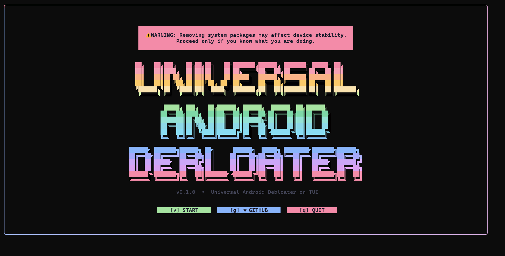
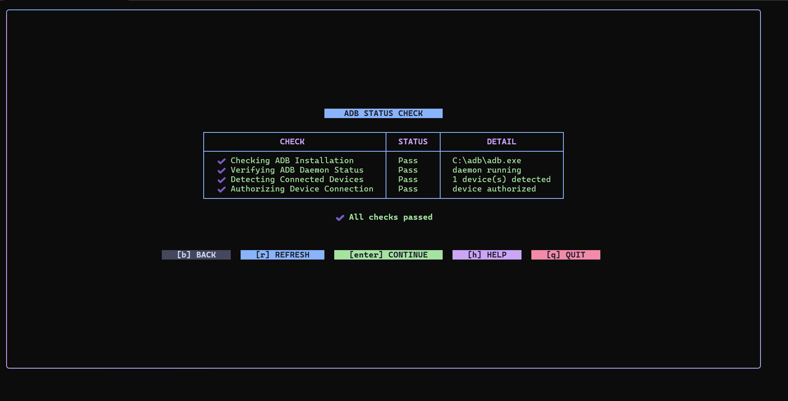
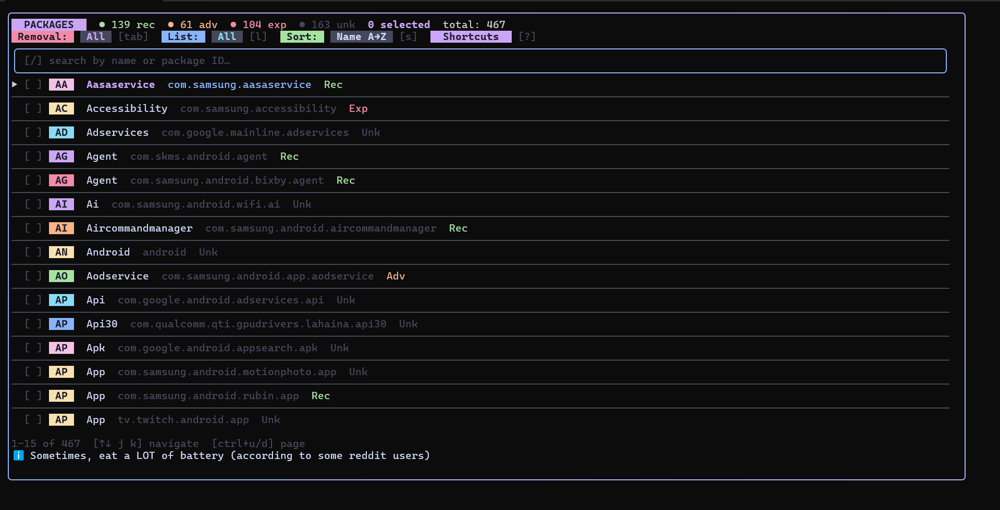
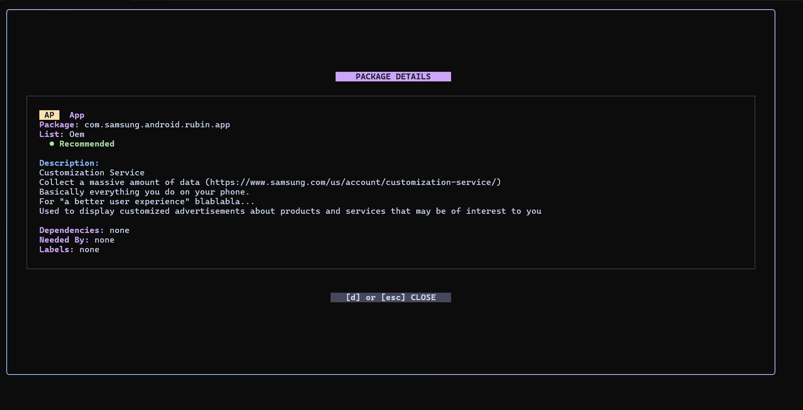
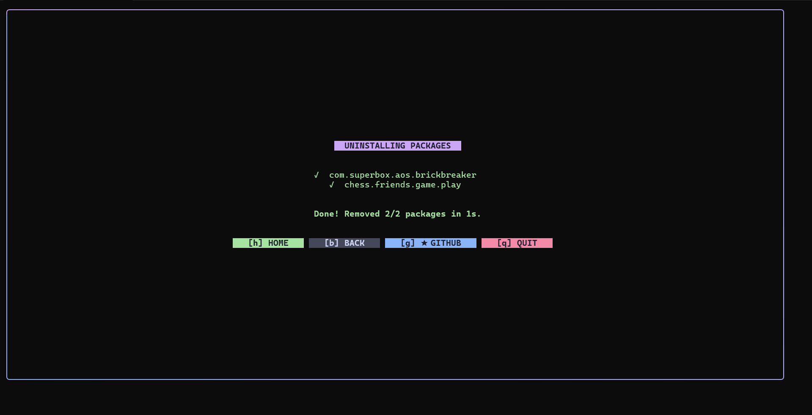
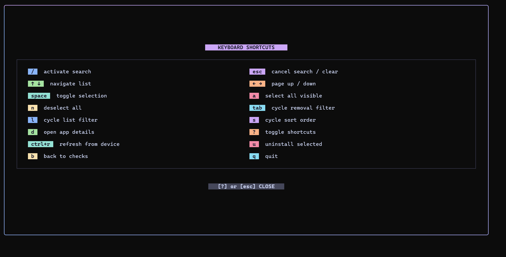

# UAD-TUI

Most people already have a PC, but the common options for debloating Android devices are either:
- UAD itself, which is a standalone GUI .exe application mostly used once and forgotten.
- Raw ADB commands where you manually search package names and uninstall apps one by one.

UAD-TUI solves both problems by bringing the debloating experience directly into the terminal with a fast and lightweight interface. You can browse packages, search apps, filter them, and uninstall multiple packages without dealing with long ADB commands or heavy GUI tools.


Built using [Bubble Tea](https://github.com/charmbracelet/bubbletea) and [Lip Gloss](https://github.com/charmbracelet/lipgloss).

---

## Features

- Fast terminal-based Android debloating using ADB
- Search, filter, and sort installed packages
- Batch uninstall multiple apps at once
- Package descriptions and removal recommendations
- Clean interface

---

## Screenshots
1. Welcome

2. Checks

3. Packages

4. Description

5. Progress

---

## How to Run

Requirements:

* ADB installed and added to PATH
* USB Debugging enabled on your Android device

Run directly from PowerShell:

```
iwr -useb https://raw.githubusercontent.com/AdarshaKarki/UAD-TUI/main/install.ps1 | iex
```
---

## Shortcuts

---
## Credits
Package metadata and removal recommendations use the uad_lists.json database from [Universal Android Debloater Next Generation](https://github.com/Universal-Debloater-Alliance/universal-android-debloater-next-generation).

---

## Notes

* Packages are removed using:

```
pm uninstall --user 0
```

* This removes apps only for the current user, meaning the packages are not fully deleted from the system partition
* Most removed apps can be restored later using ADB commands or by performing a factory reset
* Some packages may not include metadata if they are missing from `uad_lists.json`